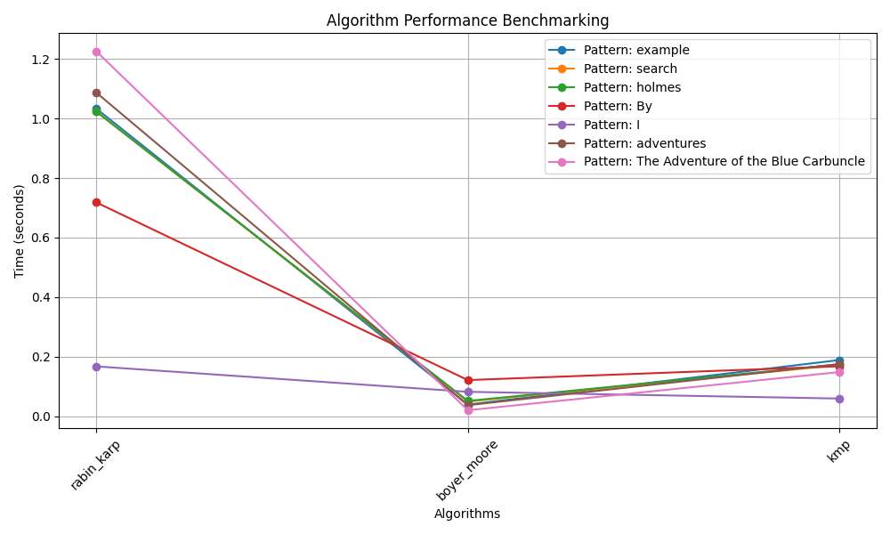

# Text Search Algorithms Comparative Analysis

This project implements and compares different text search algorithms for efficient substring searching within a given text. The project analyzes the time complexities, memory usage, and practical performance of the algorithms on real-world text data.

## Algorithms Implemented

### Rabin-Karp Algorithm

The Rabin-Karp algorithm uses hash functions to compare patterns against substrings in the text efficiently. It calculates hash values for both the pattern and sliding windows of text and then compares these hash values to find matches.

### Boyer-Moore Algorithm

The Boyer-Moore algorithm works by scanning the text from right to left and skipping sections of text based on precomputed tables. It uses a bad character table to determine the shift when a mismatch occurs and can provide substantial performance improvements for certain types of text and patterns.

### Knuth-Morris-Pratt (KMP) Algorithm

The KMP algorithm constructs a "failure" or "longest prefix which is also a suffix" array that helps determine the next possible position to resume matching after a mismatch. This allows the algorithm to skip unnecessary comparisons and improve performance.

## Benchmarking

The project benchmarks the three algorithms on various patterns and a single text data sample. The provided `main.py` script performs benchmarking and outputs execution times for each algorithm and pattern combination.

## Instructions

1. Clone the repository.
2. Add your text data to `text1.txt`.
3. Run the `main.py` script to benchmark the algorithms with different patterns.
4. The benchmark results will be printed to the console.
5. The benchmark results will also be plotted using Matplotlib, and the plot will be displayed in a pop-up window.

## Benchmarking Results

The following image displays the benchmarking results of the algorithms using Matplotlib:

